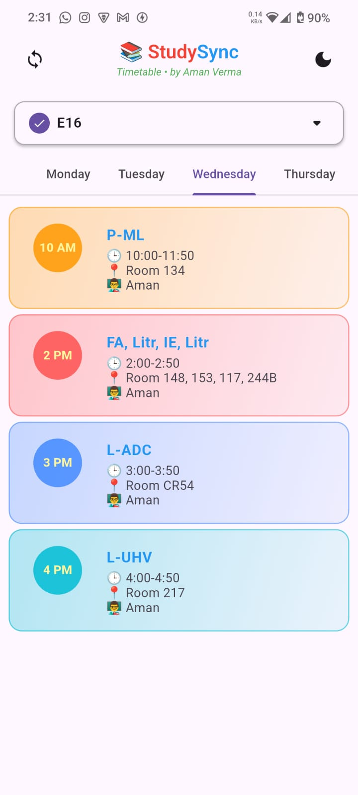
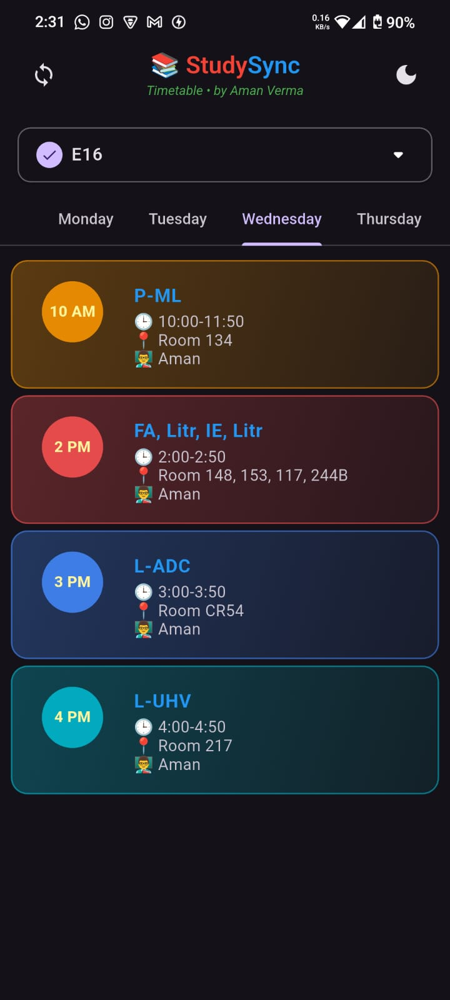

# StudySync - Timetable App 📚

<div align="center">

</div>

A beautiful Flutter timetable application that helps students track their class schedules with ease. Features include multi-batch support, day-wise view, and offline caching.

## Features ✨

- 🗓️ Weekly timetable view with tab navigation
- 🔄 Liquid pull-to-refresh functionality
- 🌙 Dark/Light mode toggle
- 📱 Offline support with cached data
- 🎨 Color-coded subjects for quick identification
- 🔍 Quick week switching (previous/next week)
- 📲 Splash screen for better user experience
- 🔄 Automatic sync with remote timetable data

## Screenshots 📸

| Light Mode                                                                                                      | Dark Mode                                                                                                     |
|-----------------------------------------------------------------------------------------------------------------|---------------------------------------------------------------------------------------------------------------|
|  |  |
## Installation ⚙️

### Prerequisites
- Flutter SDK (version 3.0.0 or higher)
- Dart SDK (version 2.17.0 or higher)
- Android Studio/Xcode (for emulator/simulator)

### Steps
#### 1. Clone the repository:
   ```bash
   git clone https://github.com/yourusername/studysync.git
   cd studysync
   ```
#### 2. Install dependencies:
```bash
flutter pub get
```
#### 3. Generate splash screen (run once):
```bash
flutter pub run flutter_native_splash:create
```
#### 4. Run the app:
```bash
flutter run
```
## Project Structure 📂
```bash
lib/
├── main.dart          # App entry point
├── screens/
│   └── timetable_screen.dart # Main timetable screen
├── utils/
│   └── local_storage.dart # Local storage
├── services/
│   ├── api_service.dart # API communication
├── models/
│   └── timetable_model.dart # Data models
└── widgets/
    └── timetable_card.dart # UI components
```
### Dependencies 📦
- http - For API calls
- shared_preferences - For local caching
- flutter_native_splash - For splash screen
- flutter_launcher_icons - For app icons


### Support ❤️
If you like this project, please consider giving it a ⭐️ on GitHub!
