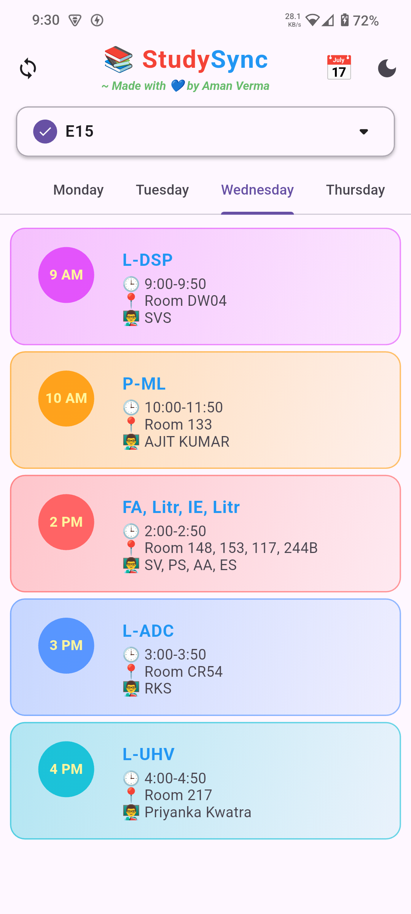
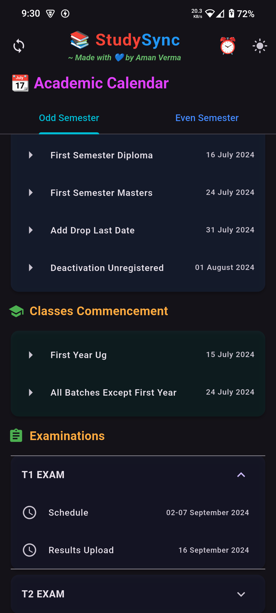
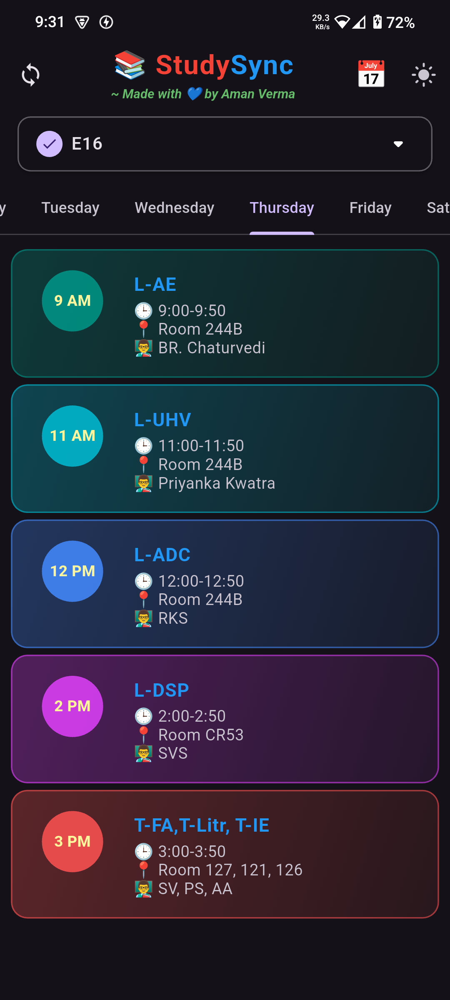

# StudySync - Timetable App 📚
<div align="center">

</div>

A beautiful Flutter timetable and academic calendar application that helps students track their class schedules and college events with ease. Now supports full **Academic Calendar** view, semester switching, and modern UI enhancements.

---

## 🌐 Now Available on Web!

StudySync is now available as a **Flutter web app**!  
You can use all features directly in your browser, with the same modern UI and experience as the mobile app.

- **Try it online:** [https://your-vercel-or-custom-domain-link](https://your-vercel-or-custom-domain-link)

---

## Related Repositories 🔗
- **Backend API & Admin Panel**: [StudySync Server](https://github.com/AmanVerma1067/StudySync-Server) - Contains the REST API for remote data management and the frontend admin panel for editing timetables.

## Features ✨
- 🗓️ Weekly timetable view with tab navigation
- 📆 Academic calendar view for odd/even semesters
- 🔄 Liquid pull-to-refresh functionality
- 🌙 Dark/Light mode toggle
- 📱 Offline support with cached data
- 🎨 Color-coded subjects for quick identification
- 🔍 Quick week switching (previous/next week)
- 📲 Splash screen for better user experience
- 🔄 Automatic sync with remote timetable data
- 💻 **Web support**: Use StudySync in your browser!

## Screenshots 📸
<div align="center">

| Light Mode | Dark Mode | Academic Calendar |
|------------|-----------|-------------------|
|  |  |  |

</div>

## Installation ⚙️

### Prerequisites
- Flutter SDK (version 3.0.0 or higher)
- Dart SDK (version 2.17.0 or higher)
- Android Studio/Xcode (for emulator/simulator)

### Steps
#### 1. Clone the repository:
   ```bash
   git clone https://github.com/yourusername/studysync.git
   cd studysync
   ```

#### 2. Install dependencies:
```bash
flutter pub get
```

#### 3. Generate splash screen (run once):
```bash
flutter pub run flutter_native_splash:create
```

#### 4. Run the app (mobile/desktop):
```bash
flutter run
```

#### 5. Run the web app locally:
```bash
flutter run -d chrome
```

#### 6. Build for web (for deployment):
```bash
flutter build web
```

---

## Project Structure 📂
```bash
lib/
├── main.dart                 # App entry point
├── screens/
│   ├── timetable_screen.dart    # Main timetable screen
│   └── calendar_screen.dart     # Academic calendar UI
├── utils/
│   └── local_storage.dart       # Local storage
├── services/
│   └── api_service.dart         # API communication
├── models/
│   └── timetable_model.dart     # Data models
└── widgets/
    └── timetable_card.dart      # UI components
```

## Dependencies 📦
- http - For API calls
- shared_preferences - For local caching
- flutter_native_splash - For splash screen
- flutter_launcher_icons - For app icons

## Support ❤️
If you like this project, please consider giving it a ⭐️ on GitHub!
